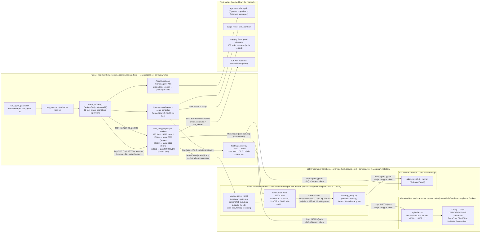
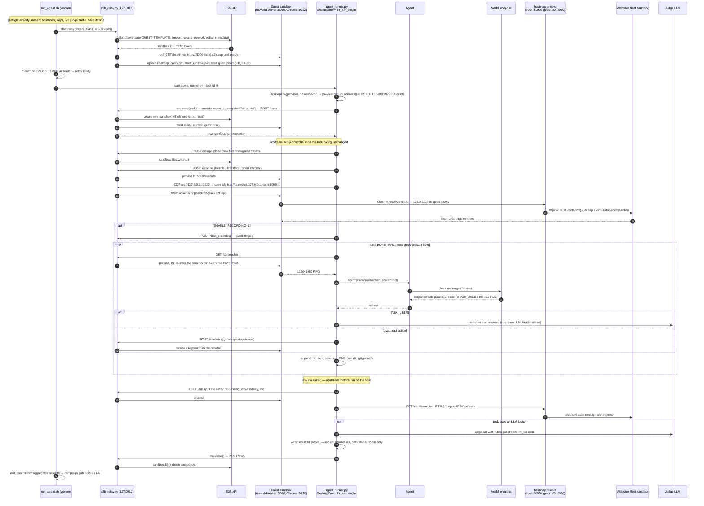

# Architecture: one OSWorld 2.0 task on E2B

OSWorld's shape is kept: the desktop VM is the thing under test, and the agent, task setup,
and evaluators run *outside* it as a client, seeing only screenshots and sending only
mouse/keyboard actions. This port swaps the VM for E2B sandboxes and adds a localhost relay
because E2B exposes sandbox ports as per-sandbox HTTPS hostnames rather than an IP with open
ports. Everything below is what actually runs for a real task, e.g. a task that opens a mocked
website in Chrome and edits a document in LibreOffice.

## What is hosted where

Reading the diagram:

- **Nothing on the host listens beyond 127.0.0.1.** The relay and the host proxy bind loopback
  only. The E2B API key and every sandbox traffic token live in the relay and proxies, never in
  the guest, so an agent with a terminal cannot read them.
- **The guest never sees the host.** It only sees inbound requests on its own server port and
  CDP port arriving via E2B ingress. Egress from every sandbox denies RFC1918, link-local and
  cloud-metadata ranges (`e2b_policy.py`).
- **Mocked websites are reached by name from two places.** Host-side setup and evaluator code
  goes through the host proxy on :8090. The browser inside the guest resolves
  `<site>.127.0.0.1.nip.io` to loopback and hits the guest-side copy of the same proxy. Both
  proxies map the site name to the fleet sandbox's per-site port because E2B ingress rejects an
  overridden `Host` header, which is why the fleet publishes one port per site.
- **One task attempt = one guest sandbox.** Strict reset (a one-line patch in `setup.sh`)
  means every `env.reset()` and every setup retry destroys the guest and creates a new one from
  the immutable template, so no state leaks between tasks or attempts.
- **Fleets live for the campaign, not the task.** The websites and GitLab sandboxes are
  launched once per `OSWORLD_CAMPAIGN_ID`, shared by all workers, and killed by
  `services/stop.py` at the end.

## One real task, end to end

Notes on the sequence:

- **Steps 1–6 and 9–12 are E2B-specific.** Everything between them is unchanged upstream
  code: the setup controller, `lib_run_single.run_single_example`, the agents under
  `mm_agents/`, the evaluators, the judge and user-simulator clients.
- **The relay is transparent to DesktopEnv.** DesktopEnv believes it is talking to a VM at
  127.0.0.1 with the server, CDP and VLC ports the provider reported. The relay forwards each
  request to the right `https://{port}-{sandbox}.e2b.app` host, injects the per-sandbox
  traffic token, and strips it from responses.
- **Snapshots map to E2B snapshots.** If the loop calls `save_state`, the relay captures a
  memory + filesystem snapshot; a later `revert_to_snapshot(name)` creates a fresh sandbox from
  it. The default `init_state` is simply a new sandbox from the template.
- **Timeouts.** `SANDBOX_TIMEOUT_S` (default 1 h) is an idle ceiling that the relay re-arms
  while guest traffic flows, so a multi-hour task survives and an abandoned guest expires.
- **Recording** lands as `recording.mp4` next to the trajectory in the raw result directory.
  **Live view / human takeover (VNC)** is not built yet; see
  [issue #2](https://github.com/mattteufel-e2b/osworld-v2-e2b/issues/2).

## Where a customer runs the host side

The only hard constraint is that the relay and DesktopEnv share a machine (they talk over
127.0.0.1). Any Linux VM works, including an E2B sandbox used as the coordinator. Host needs:
`uv` (Python 3.12), `ffmpeg` and `imagemagick` for the evaluators, outbound HTTPS to E2B, the
model and judge endpoints, Hugging Face, and GitHub. Node 20 is needed only to rebuild the
guest template. The customer's laptop is not required.

## Pinned inputs

All in `examples/osworld-v2/upstream.lock.json`:

| Input | Pin | How it arrives |
|---|---|---|
| `xlang-ai/OSWorld-V2` | commit `d578d2d` | `runner/setup.sh` clones it (gitignored), copies in provider + relay + policy, applies 3 one-line patches |
| `xlang-ai/osworld-server` | commit `a3cc3f0` | `template/fetch_server.sh` downloads, patches, bakes into the guest template (never redistributed) |
| Guest base image | `ubuntu:22.04@sha256:…` | `template/template.ts` via the E2B Template SDK |
| Fleet base image | `debian:bookworm@sha256:…` + Docker | `services/build_fleet_template.py` |
| `Task-Web/OSWorld-web`, `Task-Web/gitlab` | commits in lock | cloned inside the fleet sandboxes; service images pulled by digest |
| Tasks + assets | HF dataset revisions in lock | `runner/gated_data.py` downloads with the user's HF token, verifies `task-hashes.json` |
